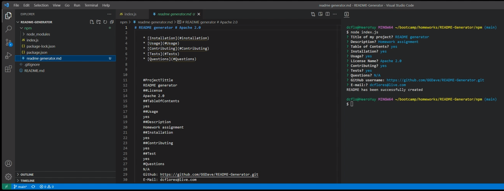

## README-Generator
>* will generate a professional README.md file from a user's input

[please click here to view a demonstration](https://drive.google.com/file/d/1USWahQ3wQOAe_O9xL0fpE1XqHiRzQxxN/view)
